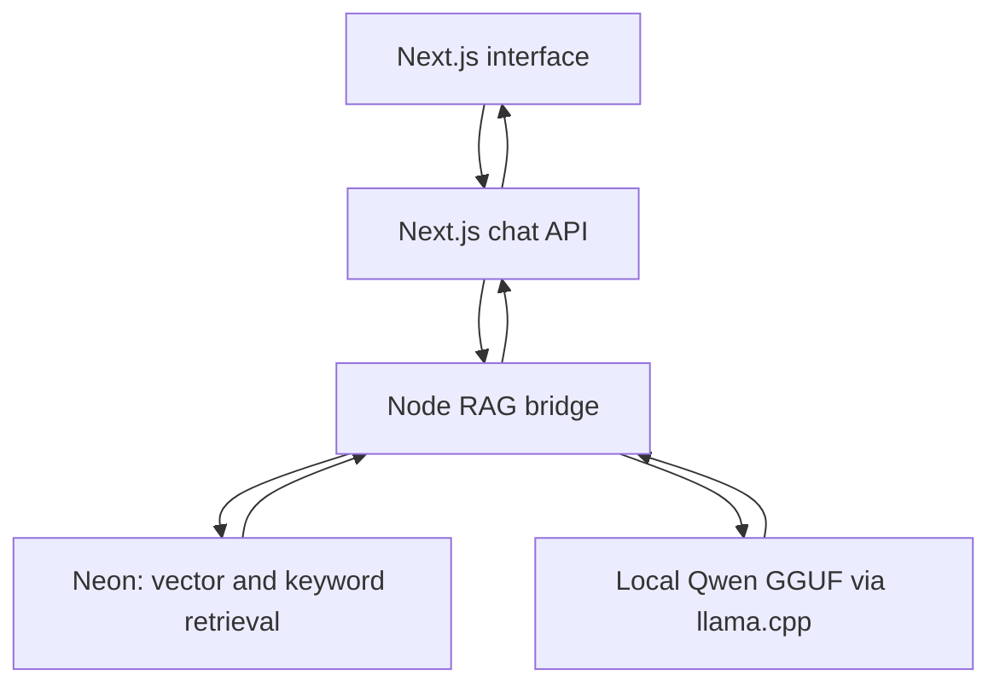

## UI walkthrough

Silent walkthrough showing the interface, source navigation,
and labelled curated examples. Model evaluation results are
documented separately below.

https://github.com/user-attachments/assets/85f3fe45-5be1-4bc2-9dbf-14b71daae05b

# FinCite

A consumer-finance RAG application and LoRA fine-tuning pipeline built to test whether source retrieval and model adaptation improve answer quality.

FinCite retrieves CFPB guidance, generates a short answer and shows the supplied passages for inspection. It helps people find and understand general guidance about credit cards, credit reports and debt notices. It cannot inspect bank accounts, freeze credit, resolve disputes or determine personal financial outcomes.

**Current status:** working local development demo with recorded retrieval, training and generation experiments. The controlled comparison does **not** establish an overall answer-quality improvement from the current adapter. Generated answers can still contradict retrieved evidence.

## What is implemented

- Next.js/TypeScript interface and Node.js chat API.
- Repeatable CFPB ingestion with snapshot hashes and source provenance.
- Eight articles, 17 validated chunks and 384-dimensional BGE embeddings stored in Neon PostgreSQL.
- Vector search, keyword search and hybrid reciprocal rank fusion.
- A separate reranker development experiment; reranking is disabled in the live app.
- Qwen3-1.7B LoRA training in free Colab, adapter reload checks and base-versus-adapter comparisons.
- Merged Q4_K_M GGUF inference on a Windows CPU using llama.cpp.
- Citation-ID checks, visible missing-citation warnings and raw evaluation records.

Example buttons show curated previews. Type a custom question to use live retrieval and generation.

## Architecture



The bridge reuses a pinned embedding model, considers the hybrid top five results and supplies at most two whole passages that fit the input budget. The local model uses a 2,048-token context and up to 256 generated tokens. Retrieved sources are labelled as cited by the model or retrieved only. A valid citation ID does not prove that the cited passage supports a claim.

## Recorded development results

These are small development experiments, not final held-out benchmark results.

### Retrieval: 10 answerable development questions

| Method | Accepted source hit@5 | Source MRR@5 |
| --- | ---: | ---: |
| Vector | 1.000 | 0.950 |
| Keyword | 1.000 | 0.933 |
| Hybrid | 1.000 | 0.900 |
| Hybrid + reranker | 1.000 | 1.000 |

The reranker corrected the first supporting-source rank for two questions. All 17 chunks were considered in that experiment, so these numbers do not demonstrate performance at larger scale. [Retrieval records and limitations](docs/retrieval-development-results.md).

### LoRA development experiment

48 training examples, 12 validation examples, three epochs and 36 finite optimizer updates. Reference-answer validation loss decreased from **4.4014 to 1.2258**, selecting epoch 3. Validation was also used for checkpoint selection; lower loss is not proof of better generated answers. Candidate semantic review remains pending. [Training results](docs/finetuning-development-results.md).

### Local end-to-end development run

All **13/13 requests completed**; median observed API request time was **12.42 seconds** on the development laptop. All 10 answerable responses contained citation IDs, but review identified unsupported claims and missing qualifications. This timing includes retrieval and inference with already-running services; it is not a cold-start or load benchmark. [Local review](docs/local-development-answer-review.md).

### Controlled base-versus-adapter comparison

Both versions received identical reconstructed evidence and prompts for the 13 development questions in Colab. Citation IDs appeared in **10/10 answerable base responses** and **9/10 adapter responses**. The adapter introduced a furnisher-first dispute sequence, invented an exception for sending original documents and omitted important notice details. Both models incorrectly applied the purchase grace period to cash advances. These observations do not establish overall improvement from fine-tuning. [Comparison and review](docs/controlled-comparison-development-results.md).

The Colab comparison uses grouped source quotes reconstructed from the saved local response. Its message formatting and precision differ from the local quantized deployment. It isolates adapter behavior within that comparison, not the effect of quantization.

## Run the existing local demo

Requires Node.js, npm, a configured Neon database, local validated chunks, the exported GGUF and the Windows CPU runtime. Model weights, runtime binaries, raw/processed data and credentials are excluded from Git; cloning alone does not restore those artifacts.

Install JavaScript dependencies from the repository root:

```powershell
npm ci --prefix ingestion
npm ci --prefix apps/web
```

Create `apps/web/.env.local` with server-only values:

```dotenv
DATABASE_URL=your_neon_connection_string
FINCITE_API_URL=http://127.0.0.1:8081
```

### Terminal 1: local inference

Place the exported model at `inference/models/fincite-v01-q4_k_m.gguf` and the b11476 Windows CPU runtime under `inference/runtime/b11476`. From the repository root:

```powershell
$server = Get-ChildItem inference/runtime/b11476 -Recurse -Filter llama-server.exe -File |
    Select-Object -First 1

& $server.FullName `
    --model inference/models/fincite-v01-q4_k_m.gguf `
    --alias fincite-v01 `
    --host 127.0.0.1 --port 8080 `
    --n-gpu-layers 0 --ctx-size 2048 --parallel 1 `
    --threads 4 --batch-size 128 --ubatch-size 128 --jinja
```

### Terminal 2: retrieval bridge

```powershell
Set-Location ingestion
node --env-file=../apps/web/.env.local serve-local-rag.mjs
```

### Terminal 3: frontend

```powershell
Set-Location apps/web
npm run dev
```

Open http://localhost:3000. All three processes must remain running. This is a local demo; public hosted inference is not implemented. No paid inference provider is required for this configuration.

## Validation and evaluation

From the repository root, with the local corpus artifacts available:

```powershell
node evaluation/validate.mjs
node evaluation/validate-chunks.mjs
node --test ingestion/test-live-rag.mjs
```

With the three services running, record development responses:

```powershell
node evaluation/run-local-development.mjs
```

This runner checks integrity and records responses; it does not automatically grade correctness or grounding. Do not send other questions while recording a sequential run.

Source ingestion is implemented in `ingestion/download-sources.mjs`, `extract-snapshots.mjs` and `chunk-documents.mjs`. Database setup and document/embedding imports are separate scripts. A fresh download can differ from the recorded snapshots; preserve provenance and regenerate matching manifests and imports before comparing runs.

## Reproducibility

| Component | Pinned configuration |
| --- | --- |
| Base model | `Qwen/Qwen3-1.7B`, revision `70d244cc86ccca08cf5af4e1e306ecf908b1ad5e` |
| Embeddings | `Xenova/bge-small-en-v1.5`, revision `ea104dacec62c0de699686887e3f920caeb4f3e3` |
| Reranker experiment | `Xenova/ms-marco-MiniLM-L-6-v2`, revision `a09144355adeed5f58c8ed011d209bf8ee5a1fec` |
| Training libraries | Transformers 4.51.3, PEFT 0.15.2, Accelerate 1.6.0 |
| GGUF converter | llama.cpp revision `18b5f8b1862ebfe0f1c33d2355b81a54d2fec867` |
| Local GGUF SHA256 | `a58fb6679a4af4eaa0625d7049ecc55478382590d5fe1639d5365d2243a59e5b` |

Notebooks, dataset manifests, configurations and raw results live in `training/`, `inference/` and `evaluation/`. The adapter/model artifacts are retained separately from Git.

## Remaining work

- Improve preservation of source qualifications, citation coverage and answer grounding.
- Review candidate data and check semantic overlap across splits.
- Build an independently reviewed held-out test set with more articles and questions.
- Measure unsupported-answer rate, answer coverage, false refusals and citation support together.
- Complete clean-machine artifact restoration, public deployment and the presentation demo.

The engineering result so far is a functioning pipeline with reproducible development comparisons and documented regressions. A claim that FinCite reduces hallucinations remains unproven.
